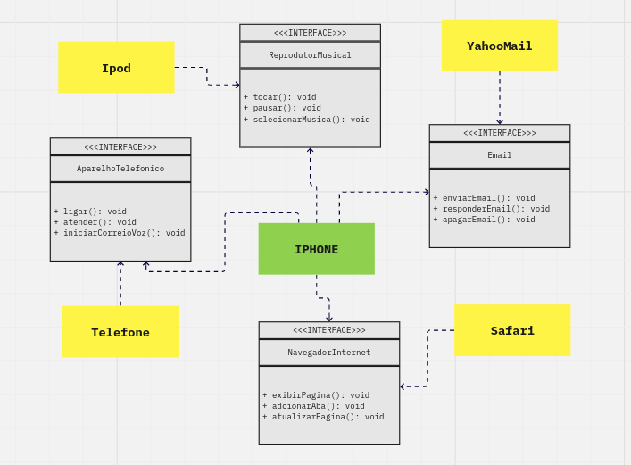

# Diagramação de Classes iPhone 2007

Este repositório contém um projeto de diagramação de classes com base no vídeo de lançamento do iPhone de 2007. O objetivo deste projeto é ilustrar a estrutura de classes e as relações entre os principais papéis do icônico dispositivo móvel lançado pela Apple.

O presente repositório é um desafio de código do Bootcamp Desenvolvimento Java com Cloud AWS da Digital Inovation One.

## Diagramação UML

